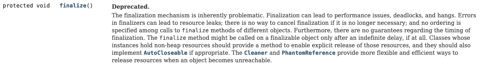

# 아이템 8. finalizer와 cleaner 사용을 피하라

## 자바 객체 소멸자, finalizer와 cleaner
자바에서는 두 가지 객체 소멸자를 제공한다. 바로 ```finalizer```와 ```cleaner```가 있다. <b>```finalizer```는 예측할 수 없으며, 상황에 따라 위험하므로 일반적으로 불필요하다.</b> 자바 9부터는 finalizer를 deprecated API로 지정하고 대안으로 ```cleaner```를 소개한다. cleaner는 별도의 스레드에서 동작해서 finalizer보다 덜 위험하다고 생각할 수 있다. 하지만, <b>cleaner도 여전히 예측할 수 없으며, 느리고, 일반적으로 불필요하다.</b>

## 1. finalizer

 다음 이미지는 [오라클 자바 9 API 문서](https://docs.oracle.com/javase/9/docs/api/java/lang/Object.html)에서 finalize 메서드 설명이다.
 


finalize 메서드는 Object 클래스에서 제공하는 기본 메서드이다. 그래서 어느 클래스에서든지 finalize 메서드를 오버라이드 할 수 있다. 가비지 컬렉터에 의해 객체가 회수 될 때, finalize 메서드가 호출된다. 문제점은 즉시 호출된다는 보장을 받을 수 없다.

그렇기 때문에 <b>한정적인 자원을 해제하는 작업을 finalizer에 구현하면 안된다.</b> 이러한 작업을 하는 경우에는 ```try-with-resources```와 ```try-finally```를 사용해서 구현한다.

다음 코드는 finalize 메서드를 오버라이드한 예제이다.

```java
public class Book {

    // 생략...

    @Override
    protected void finalize() throws Throwable {
        // 구현
        System.out.println("finalize 호출");
    }
}
```

## 2. Cleaner
```Cleaner```는 자바 9부터 지원하는 소멸자이다. cleaner를 사용할지는 내부 구현 방식에서 선택의 문제이다. 이 뜻은 Object 클래스에서 API로 제공했던 finalizer처럼 오버라이드 하는게 아닌 구성을 통해 cleaner를 사용해야 한다.

다음 코드는 AutoCloseable 인터페이스를 구현한 Room 클래스 예제이다. 

```java
package cleaner;

import java.lang.ref.Cleaner;

public class Room implements AutoCloseable {

    private static final Cleaner cleaner = Cleaner.create();

    // Room 인스턴스를 참조해서는 순환참조가 발생하므로 State는 static class 정의
    private static class State implements Runnable {
        int numJunkPiles;

        State(int numJunkPiles) {
            this.numJunkPiles = numJunkPiles;
        }

        @Override
        public void run() {
            System.out.println("Room Clean");
            numJunkPiles = 0;
        }
    }

    private final State state;

    private final Cleaner.Cleanable cleanable;

    public Room(int numJunkPiles) {
        state = new State(numJunkPiles);
        cleanable = cleaner.register(this, state);
    }

    @Override
    public void close() {
        cleanable.clean();
    }
}
```

State 클래스는 자원을 뜻하며, Room 클래스가 반드시 자원을 수거해야 하는 대상이다. State 클래스의 run 메서드는 ```cleanable```에 의해 호출된다. run 메서드가 호출되는 상황은 두 가지이다. 첫 째는 Room 클래스의 close 메서드를 직접 호출할 때이다. 두 번째는 가비지 컬렉터가 Room을 회수할 때 close 메서드를 호출하는 경우이다.

## 3. try-with-resource
```try-with-resource```는 자바7에서 추가된 기능이다. 자원을 생성하고 해제하는 코드를 중복된 형태로 반복적으로 사용하는 것을 막아준다.

try 블록에서 자원을 생성하고 finally 블록에서 직접 자원 해제 작업을 하지 않아도 된다. try 블록이 끝나면 자동으로 자원을 종료해주기 때문이다. 이러한 동작이 되기 위해서는 자원 클래스가 AutoCloseable 인터페이스를 반드시 구현해야 한다.

다음 코드는 ```try-with-resource``` 블록으로 Room 객체를 생성하고 자원을 해제하는 예제이다.

```java
try (Room room = new Room(10)) {
    System.out.println("Cleaner Example");
}
```

## 4. 결론
finalizer 또는 cleaner는 안전망 역할이나 중요하지 않은 네이티브 자원 회수용으로만 사용해야 한다. <b>안전망 용도이니 자원을 사용한 경우라면 즉시 해제 하는 것이 좋다.</b> 자원은 한정적이기 때문이다.
