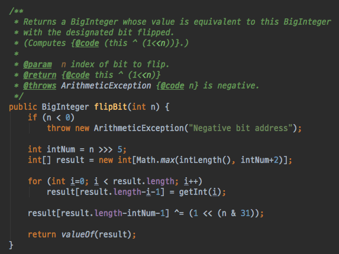

# 아이템 17. 변경 가능성을 최소화하라

## 불변 클래스
인스터스의 내부 값을 수정할 수 없는 클래스를 불변 클래스라고 말한다. 불변 인스턴스는 처음 생성될 때 주어진 정보를 간직하고 객체가 파괴되는 순간까지 유지한다. 불변 클래스는 가변 클래스보다 구현 및 사용하기가 쉬우며, 오류가 발생할 여지도 적고 안전하다. 

가변 클래스의 경우에는 인스턴스를 생성하고 나서 중간에 값이 변경될 수 있고, 이를 알아채지 못하면 오류를 발생하는 코드를 작성하기 쉽다.

## 클래스를 불변으로 만드는 규칙 5가지
1. 객체의 상태를 변경하는 메서드를 제공하지 않는다.
2. 클래스를 확장할 수 없도록 한다.
3. 모든 필드를 final로 선언한다.
4. 모든 필드를 private으로 선언한다.
5. 자신 외에는 내부의 가변 컴포넌트에 접근하지 못하도록 한다.

## 불변 복소수 클래스
```java
public final class Complex {
    private final double re;
    private final double im;

    public static final Complex ZERO = new Complex(0, 0);
    public static final Complex ONE  = new Complex(1, 0);
    public static final Complex I    = new Complex(0, 1);

    public Complex(double re, double im) {
        this.re = re;
        this.im = im;
    }

    public double realPart()      { return re; }
    public double imaginaryPart() { return im; }

    public Complex plus(Complex c) {
        return new Complex(re + c.re, im + c.im);
    }

    public static Complex valueOf(double re, double im) {
        return new Complex(re, im);
    }

    public Complex minus(Complex c) {
        return new Complex(re - c.re, im - c.im);
    }

    public Complex times(Complex c) {
        return new Complex(re * c.re - im * c.im,
                re * c.im + im * c.re);
    }

    public Complex dividedBy(Complex c) {
        double tmp = c.re * c.re + c.im * c.im;
        return new Complex((re * c.re + im * c.im) / tmp,
                (im * c.re - re * c.im) / tmp);
    }

    @Override public boolean equals(Object o) {
        if (o == this)
            return true;
        if (!(o instanceof Complex))
            return false;
        Complex c = (Complex) o;

        return Double.compare(c.re, re) == 0
                && Double.compare(c.im, im) == 0;
    }
  
    @Override public int hashCode() {
        return 31 * Double.hashCode(re) + Double.hashCode(im);
    }

    @Override public String toString() {
        return "(" + re + " + " + im + "i)";
    }
}
```

위 코드는 불변 복소수 클래스이다. 클래스에는 각 속성을 반환하는 접근자만 제공할 뿐 수정할 수 있는 메서드는 제공하지 않는다. 사칙연산 메서드를 살펴보면 특이점이 있다. 인스턴스 자체를 수정하지 않고 새로운 인스턴스(new Complex)를 생성해서 반환한다.

이러한 방식의 장점은 불변이 되는 비율이 높아진다는 것이다. 특정 메서드를 수행하더라도 인스턴스 자체의 값은 변경되지 않는다. 그리고 불변 객체가 다루기가 편하고 스레드에 안전하다.

## 불변 클래스 단점
값을 나타내는 클래스를 주로 불변 클래스로 설계한다. 이 때, 각 값이 다르면 독립된 객체를 만드는 것이 단점이다. 값이 가짓수가 많으면 이들을 모두 생성하는데 큰 비용이 들기 때문이다. BigInteger 클래스의 flipBit 메서드는 매번 새로운 BigInteger 인스턴스를 생성한다. 이러한 연산은 BigInteger의 크기에 비례해 시간과 공간을 모두 잡아 먹는다.

```java
BigInteger moby = ...;
moby = moby.flipBit(0);
```



반면에 BitSet은 BigInteger와 달리 가변 클래스이다. 따라서 원하는 비트를 빠르게 바꿔주는 메서드를 제공한다.

```java
BitSet moby = ...;
moby.flip(0);
```

이러한 불변 클래스의 단점을 대처하기 위해서 가변 동반 클래스를 두곤 한다. BigInteger 클래스는 모듈러 지수 같은 다단계 연산 속도를 높여주는 가변 동반 클래스를 가지고 있다. 또 다른 예로 String 클래스는 가변 동반 클래스로 StringBuilder를 갖고 있다.

## 정리
1. 클래스는 특정 예외 상황을 제외하고 되도록이면 불변이어야 한다.
2. 불변으로 만들 수 없는 클래스라도 변경 가능한 범위는 최소한으로 줄이자.
3. 다른 이유가 없다면 모든 필드는 private final로 선언하자.
4. 생성자는 불변식 설정이 완료되고, 초기화가 완벽히 끝난 상태에서 호출(객체 생성)을 해야 한다.