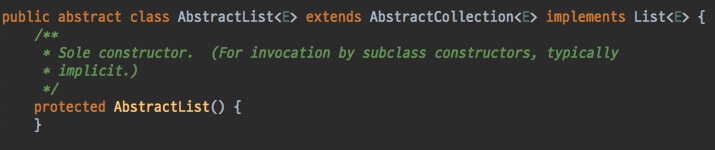

# 아이템 20. 추상 클래스보다는 인터페이스를 우선하라

## 인터페이스와 추상 클래스
자바가 제공하는 다중 구현 메커니즘은 인터페이스와 추상 클래스 두 가지가 있다. 자바 8부터는 인터페이스도 디폴트 메서드(default method) 제공할 수 있게 되어서
두 방식 모두 인스턴스 메서드를 구현 형태로 제공할 수 있다.

인터페이스와 추상 클래스의 큰 차이점은 추상 클래스가 정의한 타입을 구현하는 클래스는 반드시 추상 클래스의 하위 클래스가 된다는 점이다. 자바는 단일 상속만 지원하니,
추상 클래스를 상속 받으면 새로운 타입을 정의하는데 제약이 있다.

## 기존 정의된 클래스에 손쉽게 새로운 인터페이스를 추가할 수 있다
기존 정의된 클래스에 새로운 추상 클래스를 넣는 것은 어렵다. 이미 상속 받는 클래스가 있을 수 있으며, 계층 구조가 복잡해진다. 반면에 새로운 인터페이스를 추가하는 것은 간단하다. Comparable, Iterable, AutoCloseable 인터페이스들도 자바 플랫폼 라이브러리에 나중에 추가되었다. 

## 믹스인(mixin) 정의
인터페이스는 믹스인(mixin) 정의에 적합하다. 믹스인은 클래스가 구현할 수 있는 타입으로, '주요 타입' 외에 특정 선택적 행위를 제공한다고 선언하는 효과를 준다. 예를 들어 Comparable 인터페이스를 구현한 클래스는 각 인스턴스들끼리 순서를 정할 수 있다는 선언하는 믹스인 인터페이스이다.

## 계층구조가 없는 타입 프레임워크를 만들 수 있다
인터페이스로는 계층구조가 없는 타입 프레임워크를 만들 수 있다. 타입을 계층적으로 정의하면 개념을 구조적으로 잘 표현할 수 있다. 그런데 실제 현실에서는 명확하게 계층을 나누기에 애매한 개념이 많다. 이러한 경우에는 클래스가 아닌 인터페이스를 활용하자.

```java
public interface Singer {
    AudioClip sing(Song s);
}
 
 
public interface Songwriter {
    Song compose(boolean hit);
}
 
 
public interface SingerSongwriter extends Songwriter, Singer{
   AudioClip strum();
   void actSensitive();
}
```

## 추상 골격 구현(skeletal implementation) 클래스
추상 골격 클래스를 사용하면 인터페이스와 추상 클래스의 장점을 모두 취할 수 있다. 인터페이스로는 타입을 정의하고, 구현 방법이 명백한 것은 디폴트 메서드로 제공한다. 그리고 골격 구현 클래스에서는 나머지 메서드들을 모두 구현한다.

컬렉션 프레임워크의 AbstractCollection, AbstractSet, AbstractList 등은 컬렉션 인터페이스의 골격 구현이다.

AbstractList 추상 클래스는 List 인터페이스를 구현하고 AbstractCollection 클래스를 상속 받는다.



골격 구현의 장점은 추상 클래스처럼 구현을 도와주는 동시에 추상 클래스로 타입을 정의했을 때 오는 제약에 자유롭다는 점에 있다. 인터페이스에 기반 메서드 또는 디폴트 메서드로 기능을 모두 제공할 수 있다면, 골격 구현 클래스를 반드시 사용할 필요는 없다. 이는 자바8 부터 인터페이스에 디폴트 메서드 기능이 추가되었기 때문에 가능하다.

추상 골격 클래스를 사용하면 상속해서 사용하는걸 가정한다. 따라서 [아이템 19](item19.md)에서 설명한 설계 및 문서화 지침을 따라야 한다.

> 다중 구현용 타입으로 인터페이스가 가장 적합하다. 복잡한 인터페이스라면 골격 구현을 함께 제공하는 것도 좋은 방법이다. 그리고 명백한 기능이라면 인터페이스의 디폴트 메서드를 활용하자.