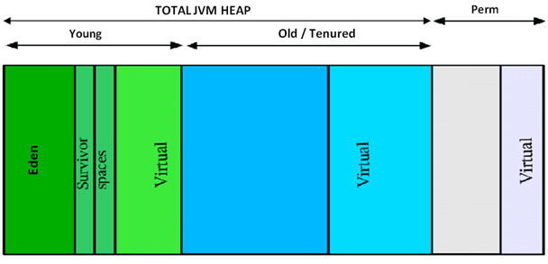

# 아이템 7. 다 쓴 객체 참조를 해제하라

C, C++ 언어는 명시적으로 메모리를 할당해서 사용하고 자원을 다 사용하고 나면 개발자가 명시적으로 해제를 한다. 가비지 컬렉터를 갖춘 자바와 같은 언어를 사용하면, 가비지 컬렉터가 다 쓴 객체를 알아서 회수한다. 그래서 메모리 문제를 개발자가 전혀 신경쓰지 않아도 된다고 오해할 수 있다.

## 가비지 컬렉션 (Garbage Collection)

시스템에서 더 이상 사용하지 않는 동적 할당된 메모리 블록 혹은 개체를 찾아서 자동적으로 다시 사용 가능한 자원으로 회수하는 것을 말한다. 가비지 컬렉션을 수행하는 부분을 가비지 컬렉터(Garbage Collector)라고 한다. Java에서는 개발자가 프로그램 코드로 메모리를 명시적으로 해제하지 않기 때문에 가비지 컬렉터(Garbage Collector)가 더 이상 필요 없는 (쓰레기) 객체를 찾아 지우는 작업을 수행한다.



```Young 영역```은 새롭게 생성한 객체의 대부분이 위치한다. 대부분의 객체가 처음에는 접근 불가능 상태가 되기 때문에 매우 많은 객체가 Young 영역에 생성되었다가 사라진다. 이 영역에서 객체가 사라질 때는  Minor GC가 발생한다.

```Old 영역```은 접근 불가능 상태로 되지 않아서 Young 영역에서 살아남은 객체가 여기로 복사된다. 대부분 Young 영역보다 크게 할당하며, 크기가 큰 만큼 Young 영역보다 GC는 적게 발생한다. 이 영역에서 객체가 사라질 때는 Major GC(Full GC)가 발생한다.


## 메모리 누수 문제가 있는 스택 클래스

다음 코드는 스택을 간단하게 구현한 예제이다.

```java
public class Stack {

    private Object[] elements;

    private int size = 0;

    private static final int DEFAULT_INITIAL_CAPACITY = 16;

    public Stack() {
        this.elements = new Object[DEFAULT_INITIAL_CAPACITY];
    }

    public void push(Object e) {
        this.ensureCapacity();
        this.elements[size++] = e;
    }

    public Object pop() {
        if (size == 0) {
            throw new EmptyStackException();
        }

        return this.elements[--size];
    }

    private void ensureCapacity() {
        if (this.elements.length == size) {
            this.elements = Arrays.copyOf(elements, 2 * size + 1);
        }
    }
}
```

스택을 구현한 코드는 ```메모리 누수``` 문제가 있다. 메모리 누수 문제는 어디서 일어나는 것일까? 스택을 구현한 코드를 다시 살펴보자.

문제는 바로 ```pop``` 메서드이다. ```elements``` 배열에서 꺼내진 객체는 가비지 컬렉터가 회수하지 않는다. <b>스택이 다 쓴 참조(obsolete reference)를 가지고 있기 때문이다.</b> 다 쓴 참조라는 뜻은 더이상 쓰지 않을 참조라는 뜻이다.

다음 코드는 ```pop``` 메서드를 통해 스택에 있는 원소를 꺼내는 예제이다.

```java
this.elements[--size];
```

스택 자체에서 배열을 통해 원소를 관리하고 있다. ```pop``` 메서드를 호출하면 배열의 마지막 원소를 반환하면서 size 값을 변화시킨다. size 값만 줄어든 것일뿐 ```elements``` 배열에는 객체 참조가 남아 있다. 반환된 원소에 대한 참조가 배열에 존재하더라도 개발자는 해당 원소에 접근할 수 없다. size 값이 인덱스 역할을 하고 있는데, 해당 위치로 다시 돌아가기 위해서는 size 값을 증가 시켜야한다.

## 메모리 누수 해결방안, null 처리

메모리 누수를 해결하는 방법은 간단하다. 해당 참조를 다 쓴 경우에 ```null``` 처리(참조 해제)를 해주면 된다. 스택 클래스에서 각 원소의 참조가 더 이상 필요하지 않는 시점은 스택에서 원소가 꺼내지는 시점이다. 

다음 코드는 ```pop``` 메서드 구현에 null 처리를 하도록 변경한 예제이다.

```java
public Object pop() {
    if (size == 0) {
        throw new EmptyStackException();
    }

    Object result = this.elements[--size];
    this.elements[size] = null;
    return result;
}
```

## 모든 객체에 항상 null 처리를 해야하나?

그렇다면 개발자는 자바에서 사용한 모든 객체에 null 처리를 반드시 해야할까? 매번 null 처리를 반드시 할 필요가 없다. 이는 코드를 복잡하게 만들뿐이다. 객체 참조에 null 처리하는 일은 예외적인 경우에 해당한다. 다 쓴 객체 참조를 해제하는 가장 좋은 방법은 참조를 유효 범위(scope) 밖으로 밀어내는 것이다. 변수의 범위를 가능한 최소가 되게 정의한다.

앞에서 살펴봤던 스택 클래스는 배열을 통해 원소를 관리하고 있다. 배열은 size라는 인덱스 값을 통해 원소를 접근한다. size 값이 변동하면서 원소를 사용하지 않는더라도 이를 가비지 컬렉터가 알 수 없다. 그렇기 때문에 비활성 영역에서 참조하는 객체는 가비지 컬렉터가 해당 객체를 회수하지 않는 일이 발생한다. <b>이처럼 메모리를 직접 관리하는 클래스인 경우에 null 처리가 적합하며, 개발자는 메모리 누수에 주의해야 한다.</b>

## 캐시 메모리 누수 주의

캐시 방식은 메모리 누수를 일으키는 주범이다. 객체 참조를 캐시에 저장하고, 객체를 사용하고나서 객체 참조를 해제하는 일을 잊어 버릴 수 있다. 이러한 경우에 캐시 외부에서 키를 참조하는 동안만 엔트리가 살아 있는 상황이 필요하다면 ```WeakHashMap```을 사용해서 캐시를 만들 수 있다. 다 쓴 엔트리는 자동으로 제거된다.

```WeakHashMap```는 ```WeakReference``` 타입을 키 값으로 사용한다. Java에서 References 종류는 ```Strong References```, ```Soft References```, ```Weak References``` 3가지가 있다. 각 References에 대한 설명과 예제는 [Guide to WeakHashMap in Java](https://www.baeldung.com/java-weakhashmap)를 참고하자.

다음 코드는 WeakHashMap을 사용한 예제이다.

```java
package reference;

import java.util.Map;
import java.util.WeakHashMap;

public class TestMain {

    public static void main(String[] args) {
        Map<Key, String> map = new WeakHashMap<>();

        Key key = new Key("name");

        // Map 에 새로운 엔트리 추가
        map.put(key, "jayden-lee");

        // Key[name]=jayden-lee
        mapPrint(map);

        // Key 객체 참조 null 처리
        key = null;

        // 강제 GC
        System.gc();

        // 빈 값 출력
        mapPrint(map);
    }

    private static void mapPrint(Map<?, ?> map) {
        map.entrySet().stream().forEach(System.out::println);
    }
}

class Key {

    private String name;

    public Key(String name) {
        this.name = name;
    }

    @Override
    public String toString() {
        return "Key[" + name + "]";
    }
}
```

<br/>

캐시를 만들 때 보통은 캐시 엔트리의 유효 기간을 정확하게 정의하기 어렵다. 시간이 지날수록 엔트리의 가치를 떨어트리는 방식을 사용한다. 이런 방식에서는 쓰지 않는 엔트리를 정리해줘야 한다.

특정 시간이 지나면 캐시 값이 의미가 없어지는 경우에는 백그라운드 쓰레드(```ScheduledThreadPoolExecutor```)를 사용해서 처리하거나 또는 새로운 엔트리를 추가할 때 부수 작업으로 수행하는 방법이 있다. ```LinkedHashMap```은 ```removeEldestEntry``` 메서드를 써서 후자의 방식으로 처리한다. 더 복잡한 캐시를 만들고 싶다면 ```java.lang.ref``` 패키지를 직접 활용해야 한다.

다음 코드는 LinkedHashMap 클래스의 removeEldestEntry 메서드이다. Map에 새로운 엔트리를 추가할 때, ```removeEldestEntry``` 메서드는 호출된다. 매개변수로는 입력된지 가장 오래된 엔트리를 전달 받는다.

```java
protected boolean removeEldestEntry(Map.Entry<K,V> eldest) {
    return false;
}
```

## 리스너 혹은 콜백 메모리 누수 주의
리스너 또는 콜백 등록 기능을 제공하는 API를 사용하는 클라이언트가 명시적으로 제거하지 않을 경우, 메모리에 점유된 상태로 남게 된다. GC가 즉시 처리하기 위해서는 콜백의 약한 참조(weak reference)만 저장한다. 예를 들어 WeakHashMap의 키로 저장하면 된다.

## 참고자료
- [Java Reference와 GC](https://d2.naver.com/helloworld/329631)
- [Java Garbage Collection](https://d2.naver.com/helloworld/1329)
- [Guide to WeakHashMap in Java](https://www.baeldung.com/java-weakhashmap)